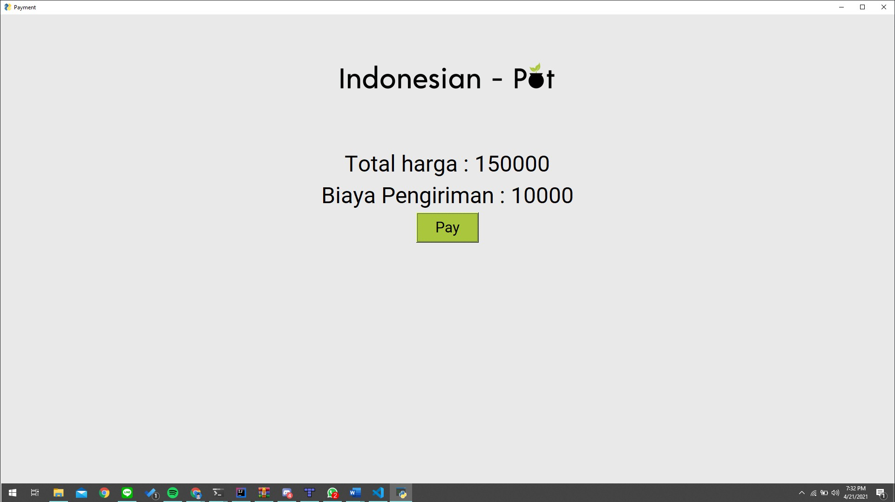
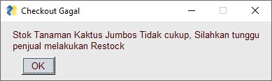

# IF2250-2021-K02-04-IndonesianPot

# Indonesian Pot
Indonesian Pot, merupakan sistem yang dibutuhkan pengguna merupakan suatu sistem untuk melakukan jual-beli tanaman, atau dapat dibilang sebuah marketplace, sistem ini menghubungkan antara penjual dan pembeli. Penjual tanaman dapat meletakkan tanaman yang ia ingin jual lewat sistem, sementara Pembeli tanaman dapat melihat tanaman apa saja yang tersedia pada sistem dan dapat membeli tanaman yang pembeli inginkan. Secara keseluruhan, Perangkat lunak yang dibangun ini berupa sebuah aplikasi yang berbasis desktop yang digunakan untuk bertransaksi tanaman secara online.

# Cara menjalankan Aplikasi
## Dependencies 
1. Python 3.9 keatas
2. Pipenv
3. Make
4. PySimpleGUI
5. PyMongo
6. Pytest (Untuk menjalankan Unit Testing)
7. Screeninfo
8. Pillow
9. Python-dotenv
10. Pylint

## Menjalankan Aplikasi
1. Jalankan Perintah `pipenv shell` pada terminal untuk memasuki virtual environment
2. Jalankan Perintah `pipenv install` pada terminal untuk melakukan instalasi akan depedencies yang diperlukan
3. Jalankan Perintah `make dev` pada terminal untuk menjalankan mode debug atau `make prod` untuk membuat file executable
4. Buka folder `dist/IndonesianPot/` dan buka Aplikasi IndonesianPot

# Pembagian dan Hasil Screenshoot
## Tabel Pembagian kerja setiap Modul
| Nama Modul                                 | Nama - NIM Penanggung Jawab       |
|----|-----------------------------------|
| Register                                   | Jesson Yo - 13519079              |
| Login                                      | Jesson Yo - 13519079              |         
| Logout                                     | Jesson Yo - 13519079              |         
| Mengubah Cart                              | Jesson Yo - 13519079              |         
| Checkout dan Pembayaran                    | Alexander - 13519090              |         
| Pencarian Barang                           | Denilsen Axel Candiasa - 13519059 |         
| Melihat Detail Tanaman                     | Marcello Faria - 13519086         |         
| Menghitung dan Memberikan Harga Pengiriman | Alexander - 13519090              |         

## Hasil Screenshoot
### Modul Register

### Modul Login

### Modul Logout

### Modul Mengubah Cart

Cart Yang sudah terisi :

### Modul Checkout dan Pembayaran

Checkout Gagal karena cart kosong :

Checkout Gagal karena stok tidak cukup :

### Modul Pencarian Barang

Pencarian semua barang :

Pencarian suatu Barang :

Pencarian dengan barang yang tidak ada :

### Modul Melihat Detail tanaman

### Modul Menghitung dan memberikan Harga Pengiriman

# Daftar Tabel Basisdata
| Nama Tabel | Atribut                                                                                                                           |
|-----------|-----------------------------------------------------------------------------------------------------------------------------------|
| Users     |  [User-Object ID, Nama, Email, Password, Telp, Alamat]                                                               |
| Products   |  [Product-Object ID, UserID (idPenjual), Title, Harga, Deskripsi, Stok, Kategori, Aktif, imageData]         |
| Orders     |  [Order-Object ID, idPembeli, idPenjual, alamat, Status, Metode] |
| Payments   |  [Payment-Object ID, ListofOrderObjectId, Nominal, Status ]                                                            |
| Carts      | [Cart-Object ID, UserId (idPembeli), ListOfItem]                                                                                               |